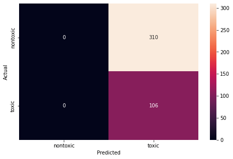

# Poisonous Plant Identifier

**Senior Project Fall 2022**

## Requirement Specifications

### Must-Have Requirements 

* Train the model on one dataset.
* Train the model using Kaggle datasets.
* Produce an accuracy score of at least 0.65 or another metric equivalent on the training data.
* Produce an accuracy score of at least 0.5 or another metric equivalent on the testing data.
* Build the model using Tensorflow.

### Nice to have Requirements 

* Train model on multiple datasets.
* Train the model on self-collected data.
* Produce an accuracy score above 0.75 on the training data.
* Produce an accuracy score above 0.65 on the testing data.
* Build the model using classes and functions in python.
* Use minimal Tensorflow functions to limit the abstraction of a machine learning model.
* Implement a machine learning model into a web application to allow for a user interface.

## Datasets

I used 2 datasets from Kaggle to train and test the model. The first dataset is [Edible wild plants](https://www.kaggle.com/datasets/gverzea/edible-wild-plants). The second is [Poisonous plants images](https://www.kaggle.com/datasets/nitron/poisonous-plants-images). 

## Model

### Hyperparameters

### Metrics

#### Confusion Matrix

## Use Model

### Streamlit App

You can use the model in the Streamlit app.

Link coming soon.
